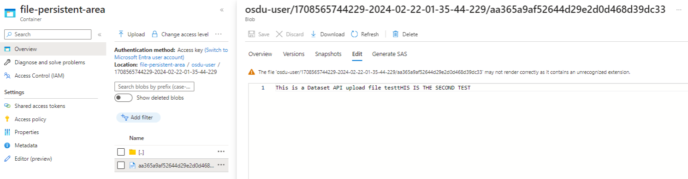
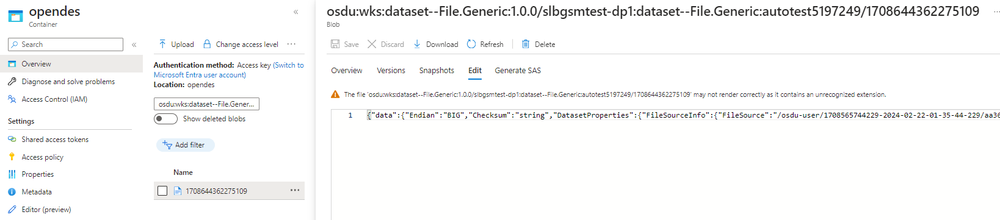
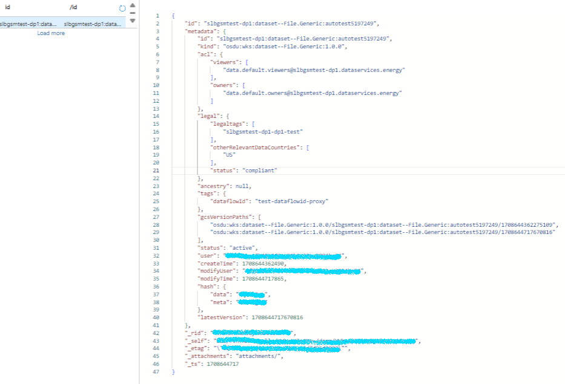
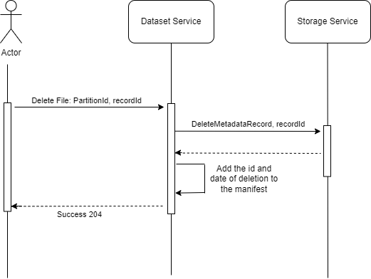

# Delete API contract

Customers have been using the `DELETE` operation in the File Service. File service is set to deprecate in the near future. Customers need to migrate to the Dataset Service which does not have the `DELETE` operation. 

From the [M22 release notes](https://community.opengroup.org/osdu/governance/project-management-committee/-/wikis/M22-Release-Notes#deprecation-notice), the functionalities of the File service is integrating with the Dataset Service. The Delete API is part of the File service functionality that needs to be added into the Dataset Service.

## Current Behavior

The current functionality of the File Service Delete API involves a soft delete process. At the upload and registration process, the file gets uploaded in a container called `file-persistent-area` in the data storage account of the provided data partition.
Here is a sample uploaded text file:



The uploaded files will have a record in the `Opendes` container on the same data Storage account and a new record in Cosmos DB which contains the information about the location of the file's information on the `Opendes` container. 

Here is how the Opendes looks like for the sample uploaded file:



Here is the metadata record on the Cosmos DB for the same file:



*Note:* 
- To run a test the file got registered two times that is why in the `gcsVersionPaths` there are two destinations on the Opendes.
- The `id` helps us to locate the entry in the Cosmos DB.

Now the Delete scenario in the File Service Delete API needs to clean up all three areas. Initially, the API calls the Storage Service Delete API to perform cleanups on the `Opendes` container, which holds information about the file location. Subsequently, traces on the Cosmos DB, which contains metadata about the file, are removed. Finally, the File Service proceeds to clean up the Persistent container that holds the actual data.

For more information on the deletion process in Storage Service please check the [this tutorial](https://community.opengroup.org/osdu/platform/system/storage/-/blob/master/docs/tutorial/StorageService.md?ref_type=heads#delete-record).

## Dataset Delete API overview

This API should be supporting `soft` delete following by purge. (Open question about the difference between what we have currently on File Service and what needs to be done on Dataset)

Currently there is no API supporting the delete request from the user if the dataset:

* is no longer needed
* no longer owned by the user
* taking too much space
* has been added in error

Here is the sequence of the events to have a successful soft delete using Dataset Service:



During `Soft` delete, the deleted files will be removed from index by the storage delete records endpoing and won't be searchable. This delete is revertable.

The `Purge` action will be an automatic job that runs once per week to clean up the Persistent storage from the soft deleted files. Therefore, evertime `soft` delete happens we need to keep a manifest of the deleted file id and the date. The purge operation will clean up files older than 7 days old in that manifest. 

#### Scope: 

* DELETE api for the dataset service, which will replace the file service for storing simulation data. 
* Need for soft delete (hide data from users), hard delete (purge data from storage), and move data between projects.

#### Personas:

Consultants, data managers, asset managers.

#### Entitlements

Current File Service uses `users.datalake.editors` or `users.datalake.admins` as required roles to perform deletion of a file metadata record.

## POST /registeredDataset/{datasetId}/metadata

This is the `soft` delete request that makes a call to the Storage Service to perform soft delete on the cosmosdb record as well as `opendes` container. It also adds the id of the file and datetime of deletion to a separate file to keep track of the deleted files on the `Persistent` container for either Purge action or retrieval call.

### Request

Delete metadata record and file associated with that record for the given id.

```text
POST http://{{DATASET_HOST}}/registeredDataset/{datasetId}/metadata
content-type: application/json; charset=utf-8
```

#### Params

* **data-partitioon-id**: Specifies the data partition to use. This should either be the partition name or crm account associated with the partition.

* **datasetId**: Metadata record Id.
  
### Response

#### Success 

```text
HTTP/1.1 204 No Content
```
**Description:** Record Deleted Successfully.

#### Failure to match the registration ID for DELETE

```text
HTTP/1.1 400 BAD REQUEST
Content-Type: application/json; charset=utf-8
```

**Example Schema Value**

```json
{
  "error": {
    "errors": [
      {
        "message": "string",
        "reason": "string",
        "domain": "string"
      }
    ],
    "code": 0,
    "message": "string"
  }
}
```

#### Failure Auth token is invalid or has expired

```text
HTTP/1.1 401 INVALID CREDENTIALS
Content-Type: application/json; charset=utf-8
```

**Example Schema Value**

```json
{
  "error": {
    "errors": [
      {
        "message": "string",
        "reason": "string",
        "domain": "string"
      }
    ],
    "code": 0,
    "message": "string"
  }
}
```

#### Failure on User not having sufficient permissions to perform DELETE

```text
HTTP/1.1 403 INSUFFICIENT PERMISSION
Content-Type: application/json; charset=utf-8
```

**Example Schema Value**

```json
{
  "error": {
    "errors": [
      {
        "message": "string",
        "reason": "string",
        "domain": "string"
      }
    ],
    "code": 0,
    "message": "string"
  }
}
```


#### Failure to Find the record to DELETE

```text
HTTP/1.1 404 RECORD NOT FOUND
Content-Type: application/json; charset=utf-8
```

**Example Schema Value**

```json
{
  "error": {
    "errors": [
      {
        "message": "string",
        "reason": "string",
        "domain": "string"
      }
    ],
    "code": 0,
    "message": "string"
  }
}
```

#### Failure when DELETE cannot be performed

```text
HTTP/1.1 500 INTERNAL SERVER ERROR
Content-Type: application/json; charset=utf-8
```

**Example Schema Value**

```json
{
  "error": {
    "errors": [
      {
        "message": "string",
        "reason": "string",
        "domain": "string"
      }
    ],
    "code": 0,
    "message": "string"
  }
}
```

#### Failure when Bad Gateway

```text
HTTP/1.1 502 BAD GATEWAY
Content-Type: application/json; charset=utf-8
```

**Example Schema Value**

```json
{
  "error": {
    "errors": [
      {
        "message": "string",
        "reason": "string",
        "domain": "string"
      }
    ],
    "code": 0,
    "message": "string"
  }
}
```

#### Failure when Service is unavailable

```text
HTTP/1.1 503 SERVICE UNAVAILABLE
Content-Type: application/json; charset=utf-8
```

**Example Schema Value**

```json
{
  "error": {
    "errors": [
      {
        "message": "string",
        "reason": "string",
        "domain": "string"
      }
    ],
    "code": 0,
    "message": "string"
  }
}
```
## GET list of deleted items /{deletedListPath}/list

Get list of soft deleted items.

```test
HTTP/1.1 200 SUCCESS
Content-Type: application/json; charset=utf-8
```

#### Response

```json
{
  "items": [
    {
      "id": "file Id",
      "deletionDate": "deletion date"
    },
    ...
    {
      "id": "file Id",
      "deletionDate": "deletion date"
    }
  ]
}
```

**Note:** the failures follows the standard, 400, 403 and 500 errors. 

## POST Retrieve a deleted file  /{deletedpath}/retrieveFile

Retrieve a deleted file from the list of the delete files.


#### Params

* **data-partitioon-id**: Specifies the data partition to use. This should either be the partition name or crm account associated with the partition.

* **id**: record Id.

```test
HTTP/1.1 200 SUCCESS
```

#### Failure on User not having sufficient permissions to perform DELETE

```text
HTTP/1.1 403 INSUFFICIENT PERMISSION
Content-Type: application/json; charset=utf-8
```


### Risk

* Lineage might be broken : DELETE API will delete data and associated manifest entries in ADME SOR. SLB confirmed that related data is also cached in Delfi layer. If cached data is not deleted along with data that DELETE method will delete.

* Lack of granular data admin role: DELETE API needs to work with roles that OSDU entitlement provides. Currently OSDU entitlement service provides only view and owner roles and not admin role. 
